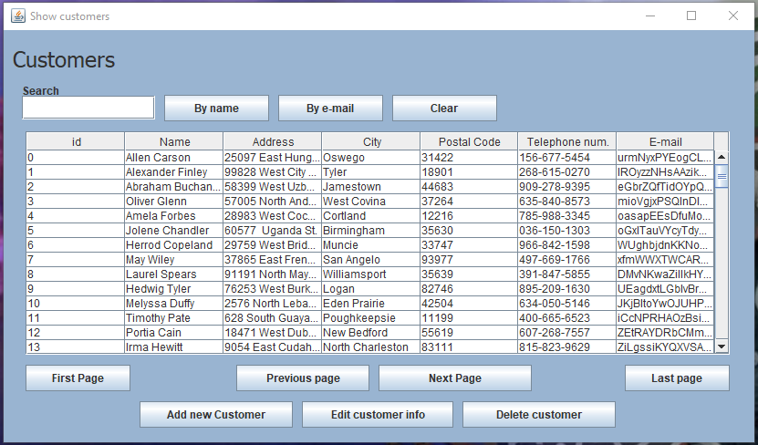
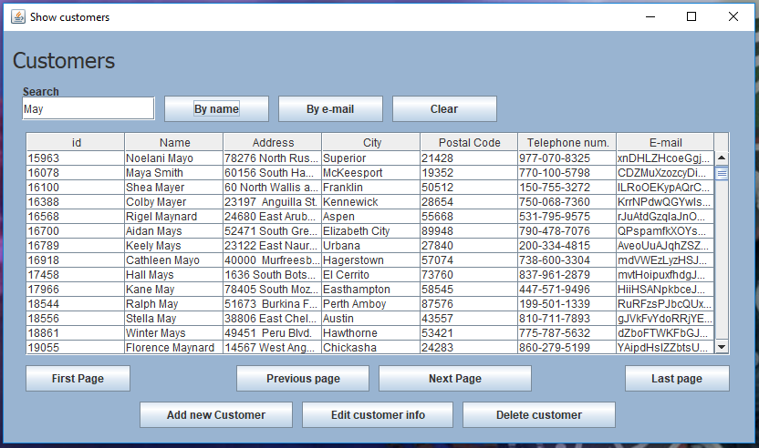
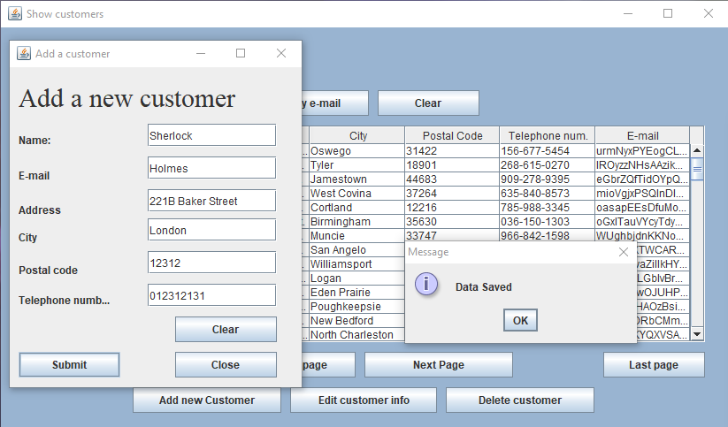
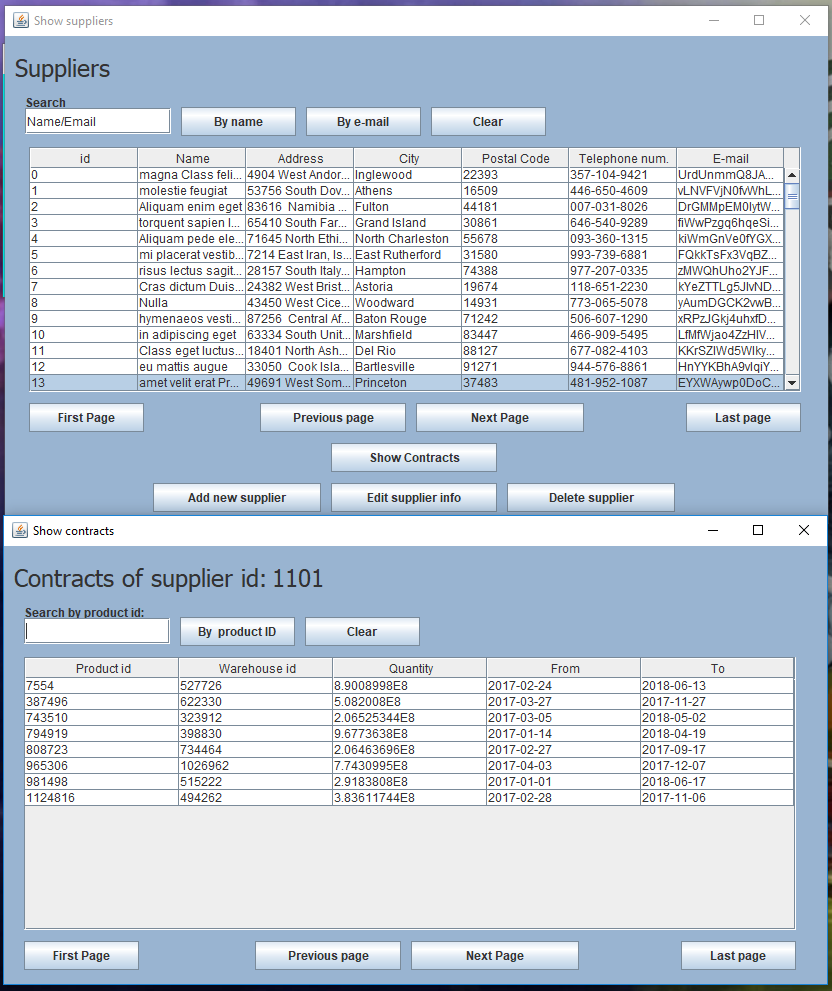

# System for managing and distributing medical products

Project contributors : Sultan Numyalai, Miroslav Čuvar <br />
School               : FIIT<br />
Instructor           : Miroslav Demovic<br />
Year                 : 2017-2018<br />
Semester             : Summer<br />

## Assignment
In your chosen environment, create a database application that comprehensively addresses the below-defined scenarios in your chosen domain. Discuss with your instructor about the exact scale and specification of the scenarios. The project is solved in pairs, and it is expected that you will use git to synchronize your work with your classmate.

## Data Model
The project revolves around an application that handles database for managing storage and distribution of medical products. The application is intended to be used by the company managers that are in charge of handling orders, receipts and supplier contracts.

Following is the Physical data model of the project
<br />

## Application scenarios

### Browse entries
User can list the entries of a given table and browse their pages. The table lists 100 entries and it's possible to go forwards and backwards as well as return to the first page or skip to the last.
<br/>
All of the tables and searchable by different criteria. Tables that have a name and/or e-mail value are searchable by either one of them, and the user doesn't have to specify the full string. For example:
<br/>

### Add entries
The user can add entries of customers, suppliers, warehouses, products and orders. When adding an order, the corresponding order entries ```polozka_v_objednavke``` and receipt ```faktura``` are created and subsequently added to the database. 
<br/>

### Edit entries
When browsing entries, the user can select an entry from the table and change its data. 
<br/>

### Delete entries
Similarly, the user can also delete the selected entry from the database. Note however that it is not possible to delete entries that are bound to other entries in the database as the table column do not have ```CASCADE``` enable (We discussed this issue and agreed on not allowing this, as the company is likely to want to keep full logs of sales and contracts).
<br/>

### Show additional entries
Warehouses, suppliers, products are referenced in other tables and it is therefore possible to list those entries that reference them.  
<br/> 

## Implementation

We programmed this application with Java programming language, using JDBC interface for connecting to a database implemented in PostgreSQL. 

The application is supposed to be ran from the Login class, where we simulated a login scenario for the user to enter his account information (The user management part of this project was beyond our scope, so the only acceptable username and password combination is:
> Username: 1<br/>
> Password: 1